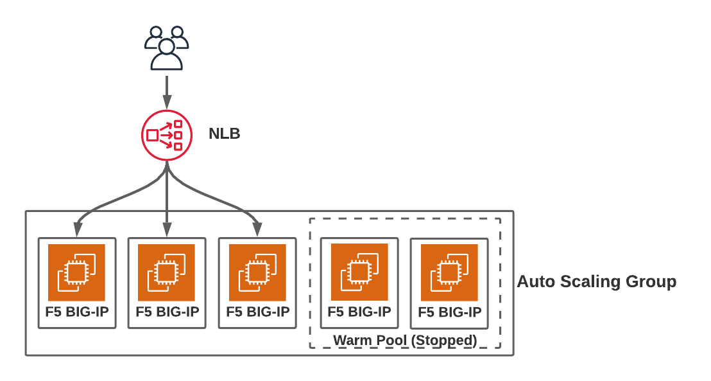

# F5 Warm Pool Demo
A basic demonstration of using warm pool and lifecycle events to speed up and streamline the scaling of BIG-IP instances in AWS. The accompanying DevCentral article for this repository can be found [here](https://devcentral.f5.com/s/articles/Getting-the-Most-out-of-Amazon-EC2-Autoscale-Groups-with-F5-BIG-IP)



## Getting Started

To provision the demo infrastructure defined in this repository, you will need a current version of [HashiCorp Terraform](https://www.terraform.io/downloads.html) and working [AWS Access Key and Access Secret](https://docs.aws.amazon.com/general/latest/gr/aws-sec-cred-types.html#access-keys-and-secret-access-keys)

Once installed, clone down this repository and provision the infrastructure using Terraform by running the following command in the repository's root directory:

```
$ terraform apply
```

The template will use PAYG or AWS pay-as-you-go licensing by default. To use BYOL licensing with BIG-IQ, create a Terraform variables file in the repoitory's root directory called **terraform.tfvars** and populate the file with the following variables:

```
license_type                   = "BYOL"
bigiq_server                   = "(Your BIG-IQ Instance's hostname or IP)"
bigiq_license_pool_name        = "(Name of BIG-IQ license pool being used to license BIG-IP)"
bigiq_username_secret_location = "(Username to authenticate into BIG-IQ and get license)"
bigiq_password_secret_location = "(Password to authenticate into BIG-IQ and get license)"
```

## What gets built?

As part of the Terraform template, here is a high level overview of what is provisioned:

* VPC with a private and public subnet.
* AWS Managed NAT Gateway
* EC2 Auto Scaling Group containing 3x F5 BIG-IP VEs. 1 of 3 BIG-IPs is part of the warm pool and stopped by default.
* NLB to load balance across Auto Scaling Group instances.
* SNS topic to handle Auto Scaling Group lifecycle hooks.
* Lambda function to handle and process lifecycle events sent by SNS.
* S3 bucket to store F5 AS3 configurations.
* A bunch of IAM policies and roles to provide permissions across the various AWS services utilized.
* A couple security group to enable network communicate of AWS services and F5 BIG-IP.

<!-- BEGINNING OF PRE-COMMIT-TERRAFORM DOCS HOOK -->
## Requirements

| Name | Version |
|------|---------|
| <a name="requirement_terraform"></a> [terraform](#requirement\_terraform) | >= 0.15.1 |
| <a name="requirement_aws"></a> [aws](#requirement\_aws) | >= 3.27.0 |
| <a name="requirement_random"></a> [random](#requirement\_random) | >= 3.1.0 |
| <a name="requirement_template"></a> [template](#requirement\_template) | >= 2.2.0 |

## Providers

| Name | Version |
|------|---------|
| <a name="provider_aws"></a> [aws](#provider\_aws) | 3.42.0 |

## Modules

| Name | Source | Version |
|------|--------|---------|
| <a name="module_vpc"></a> [vpc](#module\_vpc) | terraform-aws-modules/vpc/aws | 3.0.0 |
| <a name="module_bigip_1arm_autoscale"></a> [bigip\_1arm\_autoscale](#module\_bigip\_1arm\_autoscale) | ./modules/bigip-1arm-autoscale | n/a |
| <a name="module_nginx"></a> [nginx](#module\_nginx) | ./modules/nginx | n/a |

## Resources

| Name | Type |
|------|------|
| [aws_availability_zones.available](https://registry.terraform.io/providers/hashicorp/aws/latest/docs/data-sources/availability_zones) | data source |

## Inputs

| Name | Description | Type | Default |
|------|-------------|------|---------|
| <a name="input_name_prefix"></a> [name\_prefix](#input\_name\_prefix) | n/a | `string` | `"default"` |
| <a name="input_owner"></a> [owner](#input\_owner) | The name of the owner that will be tagged to the provisioned resources. | `string` | `null` |
| <a name="input_key_pair"></a> [key\_pair](#input\_key\_pair) | Name of AWS key pair to be used to access EC2 instances. | `string` | `null` |
| <a name="input_license_type"></a> [license\_type](#input\_license\_type) | Type of license used to license BIG-IP instances. BYOL or PAYG | `string` | `"PAYG"` |
| <a name="input_bigiq_server"></a> [bigiq\_server](#input\_bigiq\_server) | Hostname or IP address of BIG-IQ server used to license BYOL BIG-IP instances. | `string` | `""` |
| <a name="input_bigiq_license_pool_name"></a> [bigiq\_license\_pool\_name](#input\_bigiq\_license\_pool\_name) | Name of BIG-IQ license pool used to license BYOL instances. | `string` | `"default_pool"` |
| <a name="input_bigiq_username_secret_location"></a> [bigiq\_username\_secret\_location](#input\_bigiq\_username\_secret\_location) | Name of AWS Secrets Manager secret that contains the username used to license BYOL instances. | `string` | `"bigiq_username"` |
| <a name="input_bigiq_password_secret_location"></a> [bigiq\_password\_secret\_location](#input\_bigiq\_password\_secret\_location) | Name of AWS Secrets Manager secret that contains the password used to license BYOL instances. | `string` | `"bigiq_password"` |
| <a name="input_desired_capacity"></a> [desired\_capacity](#input\_desired\_capacity) | Desired number of BIG-IPs in autoscale group | `number` | `2` |
| <a name="input_max_size"></a> [max\_size](#input\_max\_size) | Maximum number of BIG-IPs in autoscale group | `number` | `5` |
| <a name="input_min_size"></a> [min\_size](#input\_min\_size) | Minimum number of BIG-IPs in autoscale group | `number` | `1` |

## Outputs

| Name | Description |
|------|-------------|
| <a name="output_bigip_admin_username"></a> [bigip\_admin\_username](#output\_bigip\_admin\_username) | n/a |
| <a name="output_bigip_admin_password"></a> [bigip\_admin\_password](#output\_bigip\_admin\_password) | n/a |
<!-- END OF PRE-COMMIT-TERRAFORM DOCS HOOK -->